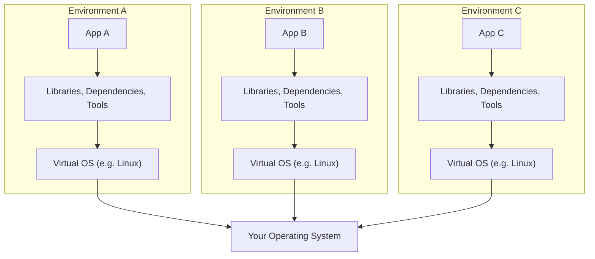
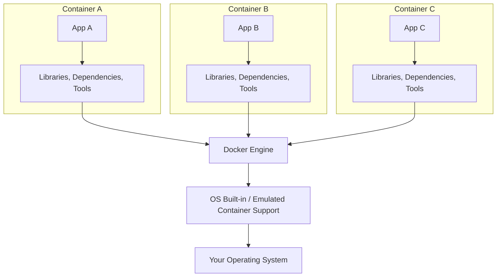

# Docker

### What is Docker?

* Docker is a container technology: A tool for creating and managing containers
* Container is a standardized unit of software.
  - a package of code**and** dependencies to run that code. (ex. Py code + the Py runtime)
  - the same container yields the exact same application and execution behaviour, irrespective of executor or the system of execution.

### Why Containers?

For independent and standardized "application packages"

* because we want the`exact same env` for dev & prod
* we want`reproducibility` of behaviour
* for isolation of dependencies/preventing dependency conflicts

### Virutal Machines vs. Docker Containers

* Simple Virtual Machine structure

- This wastes a lot of space on the hard drive and tends to be slow



| Pros of VM                                     |                      Cons of VM                      |
| ---------------------------------------------- | :--------------------------------------------------: |
| Separated environments                         |              Redundant, Waste of space              |
| Env-specific config                            |        Slow performance and longer boot time        |
| Shareable env-config for reproducing behaviour | reproducing on another server is possible but tricky |

### Docker Containers



| Docker Containers                                  | Virtual Machines                                                     |
| -------------------------------------------------- | -------------------------------------------------------------------- |
| Low impact on OS, very fast and minimal disk usage | High impact on OS, slower and higher disk usage                      |
| Sharing, re-building & distribution is easy        | Sharing, re-building & distribution can be tricky                    |
| Encapsulates the app/environment                   | Encapsulates the whole machine ~ results in bloating the application |


### Images

- Images are **blueprints / templates** for containers — they do not run themselves
- Contain the app code + required tools, runtimes, and OS dependencies
- Images are **read-only**; no application data is stored in them
- Come in two flavors:
  - **Pre-built** — pulled from Docker Hub (e.g. `node`, `python`, `nginx`)
  - **Custom** — defined by writing your own `Dockerfile`

### Containers

- Containers are **running instances of Images**
- When a container is created (`docker run`), a thin **read-write layer** is added on top of the image
- Multiple containers can run from the **same image**, each fully isolated with their own data
- Data in the container layer is **ephemeral** — lost when the container is removed

```
┌────────────────────────────────────────────┐
│  Container Writable Layer  ✏️               │  ← unique per container, lost on removal
├────────────────────────────────────────────┤
│  Layer N: CMD ["npm", "start"]  🔒          │
│  Layer 3: EXPOSE 80             🔒          │  ← read-only image layers
│  Layer 2: RUN npm install       🔒          │  ← cached & shared across containers
│  Layer 1: COPY . /app           🔒          │
│  Layer 0: FROM node (base image) 🔒         │
└────────────────────────────────────────────┘
```

### Image Layers & Caching

- Every Dockerfile instruction creates a **new layer** in the image
- Docker **caches** unchanged layers — only modified layers and those after are rebuilt
- Layers are **shared between images**, keeping images small and builds fast
- The `CMD` instruction is special: it runs when the **container starts**, not during the build

### Building a Custom Image (Dockerfile)

Key Dockerfile instructions:

| Instruction | Purpose |
|---|---|
| `FROM <image>` | Base image to build upon |
| `WORKDIR <path>` | Set working directory inside container |
| `COPY <src> <dest>` | Copy files from host into the container |
| `RUN <cmd>` | Execute a command during image build |
| `EXPOSE <port>` | Document the port the app listens on |
| `CMD ["cmd"]` | Default command to run when container starts |

```Dockerfile
FROM node                   # start from official node base image
WORKDIR /app                # all subsequent commands run from /app
COPY . /app                 # copy host project files into /app
RUN npm install             # install dependencies (runs at build time)
EXPOSE 80                   # document that app listens on port 80
CMD ["node", "server.js"]   # run the app when container starts
```

# Basic Commands

### Images

| Command | Description |
|---|---|
| `docker build .` | Build image from Dockerfile in current directory |
| `docker build -t <name> .` | Build and tag with a name |
| `docker build -t <name>:<tag> .` | Build and tag with a specific version |
| `docker build -t <name> <path>` | Build from Dockerfile in a different directory |
| `docker images` | List all locally stored images |
| `docker image inspect <name>` | Inspect image metadata (layers, config, env) |
| `docker rmi <image-id>` | Remove a specific image |
| `docker rmi -f <image-id>` | Force-remove image (even if in use) |
| `docker rmi  ` | Remove multiple images |
| `docker image prune` | Remove all dangling (untagged) images |
| `docker image prune -a` | Remove ALL unused local images |

---

### Container Lifecycle

| Command | Description |
|---|---|
| `docker run <image>` | Create and start a container |
| `docker run -p 3000:80 <image>` | Map host port 3000 → container port 80 |
| `docker run -d <image>` | Run in detached (background) mode |
| `docker run -it <image>` | Run in interactive terminal mode |
| `docker run --name <name> <image>` | Assign a custom name to the container |
| `docker run --rm <image>` | Auto-remove container when it stops |
| `docker run -d -p 3000:80 --name myapp --rm <image>` | Combine flags (most common pattern) |
| `docker ps` | List running containers |
| `docker ps -a` | List all containers (running + stopped) |
| `docker stop <id/name>` | Gracefully stop a running container |
| `docker start <id/name>` | Start a stopped container |
| `docker start -a <id/name>` | Start and attach (see output) |
| `docker start -ai <id/name>` | Start in interactive + attached mode |
| `docker rm <id/name>` | Remove a stopped container |
| `docker rm -f <id/name>` | Force-remove a running container |
| `docker rm <c-1> <c-2>` | Remove multiple containers |
| `docker container prune` | Remove all stopped containers |

---

### Attach & Detach

| Command | Description |
|---|---|
| `docker attach <id/name>` | Attach to a running detached container |
| `docker attach --sig-proxy=false <id/name>` | Attach without forwarding signals (safer) |
| `Ctrl + P, Ctrl + Q` | Detach from container without stopping it |

---

### Exec — Run Commands Inside a Container

| Command | Description |
|---|---|
| `docker exec <id/name> <cmd>` | Run a one-off command in a running container |
| `docker exec -it <id/name> bash` | Open an interactive bash shell |
| `docker exec -it -u root <id/name> bash` | Open shell as root user |
| `docker exec -it -e VAR=value <id/name> bash` | Set env variable for the session |
| `docker exec -it -w /app <id/name> bash` | Open shell in a specific working directory |

---

### Inspect & Logs

| Command | Description |
|---|---|
| `docker logs <id/name>` | View container logs |
| `docker logs -f <id/name>` | Follow logs in real time |
| `docker container inspect <id/name>` | Full container metadata (network, mounts, etc.) |
| `docker image inspect <name>` | Full image metadata (layers, env, entrypoint) |
| `docker inspect --format='{{.NetworkSettings.IPAddress}}' <id>` | Extract a specific field |

---

### Copying Files

| Command | Description |
|---|---|
| `docker cp <id>:<container-path> <host-path>` | Copy file/dir **from** container to host |
| `docker cp <host-path> <id>:<container-path>` | Copy file/dir **from** host into container |

```bash
docker cp myapp:/app/logs/error.log ./error.log   # container → host
docker cp ./config.json myapp:/app/config.json    # host → container
```

---

### Sharing Images (DockerHub)

| Command | Description |
|---|---|
| `docker tag <image> <user>/<repo>:<tag>` | Tag image with DockerHub repo name |
| `docker login` | Login to DockerHub |
| `docker logout` | Logout from DockerHub |
| `docker push <user>/<repo>:<tag>` | Push image to DockerHub |
| `docker pull <user>/<repo>:<tag>` | Pull image from DockerHub |

```bash
docker tag myapp myuser/myapp:latest
docker push myuser/myapp:latest
```

---

### Cleanup

| Command | Removes |
|---|---|
| `docker rm <id/name>` | A stopped container |
| `docker rm -f <id/name>` | A running container (force) |
| `docker container prune` | All stopped containers |
| `docker rmi <image-id>` | A specific image |
| `docker image prune` | Dangling (untagged) images |
| `docker image prune -a` | All unused images |
| `docker system prune` | Stopped containers + dangling images + build cache |
| `docker system prune -a` | Everything above + all unused images |

# Data and Volumes

### The Problem

| Problem | Cause | Solution |
|---|---|---|
| Data written in a container **doesn't persist** | Container layer is destroyed on removal | **Volumes** |
| Host file changes **not reflected** in container | Image is read-only; code is copied at build time | **Bind Mounts** |

---

### Data Categories

| Type | Who writes it | Storage | Persisted? |
|---|---|---|---|
| **App Code + Env** | Developer | Baked into Image | ✅ (read-only) |
| **Temporary App Data** | App at runtime | Memory / temp files | ❌ |
| **Permanent App Data** | App at runtime | Volumes | ✅ Must persist |

---

### Storage Types — Overview

```
┌──────────────────────────────────────────────────────┐
│                  docker run -v ...                   │
├─────────────────────┬────────────────────────────────┤
│   Volumes           │        Bind Mounts             │
│  (Managed by Docker)│       (Managed by YOU)         │
├──────────┬──────────┤                                │
│ Anonymous│  Named   │  You control the host path     │
│ (auto    │ (persist │  Best for live code sync       │
│ removed) │ removal) │  during development            │
└──────────┴──────────┴────────────────────────────────┘
```

---

### Anonymous Volumes

- Created with `-v /path/in/container` (no name given)
- Docker manages the location on the host — you don't know where
- **Auto-removed** when container stops if `--rm` was used
- Can also be declared in a `Dockerfile`: `VOLUME ["/path"]`
- Useful for **protecting specific container paths** from being overwritten by a Bind Mount

```bash
docker run --rm -v /app/node_modules <image>
```

---

### Named Volumes

- Created with `-v some-name:/path/in/container`
- **Cannot** be defined in a Dockerfile — only via `docker run`
- **NOT** removed when a container is removed
- Data survives container removal and can be re-mounted to a new container
- Best for: **databases, logs, any data that must persist**

```bash
docker run -v mydata:/app/data <image>
```

---

### Bind Mounts

- Created with `-v /absolute/host/path:/path/in/container`
- **You control** exactly where the folder lives on the host
- **Cannot** be defined in a Dockerfile — only via `docker run`
- Changes on the host are **immediately reflected** in the container (no rebuild needed)
- Best for: **live-syncing source code during development**
- ⚠️ Not suitable for production — requires a specific host filesystem path

```bash
# macOS / Linux
docker run -v $(pwd):/app <image>

# Windows CMD
docker run -v %cd%:/app <image>

# Windows PowerShell
docker run -v ${pwd}:/app <image>
```

---

### Mounting Mechanics

> **If the volume/mount target path in the container is empty:**
> → Container files are **COPIED INTO** the volume.

> **If the volume/mount is NOT empty:**
> → Volume content **takes ownership** of the folder. Existing container files are **hidden** (not deleted).

### 🛡️ Protection Rule — Specific Path Beats General Path

When a Bind Mount covers a broad path (e.g. `/app`) AND an Anonymous Volume covers a nested path (e.g. `/app/node_modules`), the **more specific path wins** — the `node_modules` folder is preserved from the container image, while the rest of `/app` is overwritten by the host mount.

```bash
# Pattern: Bind Mount whole project, protect node_modules inside container
docker run \
  -v $(pwd):/app \          # Bind Mount → live sync host code into /app
  -v /app/node_modules \    # Anonymous Volume → protect /app/node_modules
  <image>
```

---

### Read-Only Volumes & Mounts

Add `:ro` to make a volume/mount **read-only** from the container's perspective (container can read but not write):

```bash
# Read-only Named Volume
docker run -v mydata:/app/data:ro <image>

# Read-only Bind Mount (container can't write to host files)
docker run -v $(pwd):/app:ro <image>
```

---

### Comparison Table

| Feature | Named Volume | Bind Mount | Anonymous Volume |
|---|---|---|---|
| **Syntax** | `-v name:/path` | `-v /host/path:/path` | `-v /path` |
| **Persistent** | ✅ Survives removal | ✅ Survives removal | ❌ Removed with container |
| **Location** | Managed by Docker | Managed by You | Managed by Docker |
| **Shareable** | ✅ Across containers | ✅ Across containers | ❌ Unique to one |
| **Defined in Dockerfile** | ❌ | ❌ | ✅ (`VOLUME ["/path"]`) |
| **Typical Use** | Persist DB / logs | Live sync source code | Protect internal paths |

---

### Volume Commands

| Command | Description |
|---|---|
| `docker volume create <name>` | Create a new Named Volume |
| `docker volume ls` | List all Named Volumes |
| `docker volume inspect <name>` | Detailed info about a volume (path, driver, etc.) |
| `docker volume rm <name>` | Delete a specific Named Volume |
| `docker volume prune` | Remove all **unused** volumes |