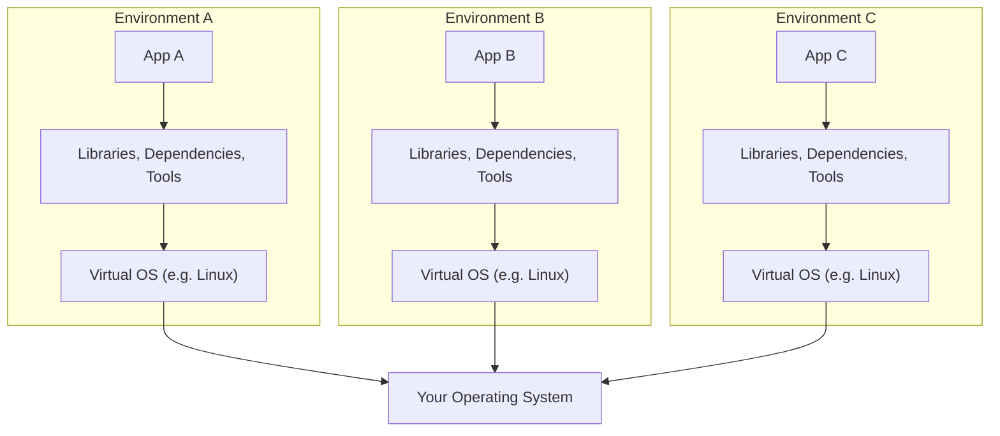
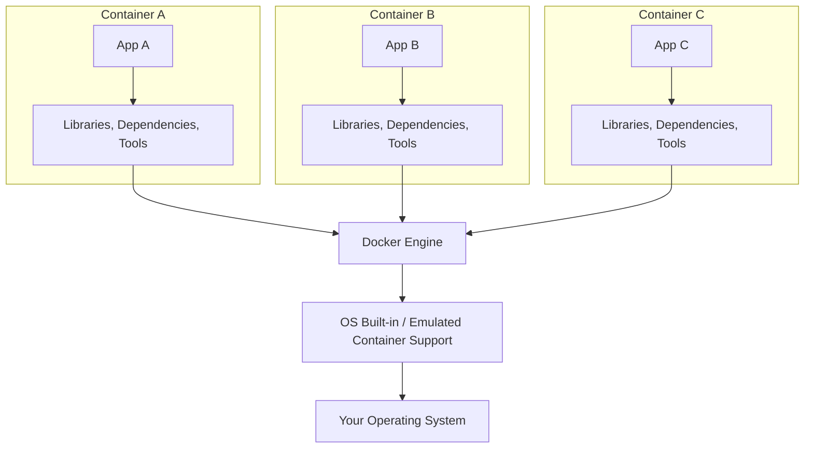

# Docker

### What is Docker?

* Docker is a container technology: A tool for creating and managing containers
* Container is a standardized unit of software.
  - a package of code**and** dependencies to run that code. (ex. Py code + the Py runtime)
  - the same container yields the exact same application and execution behaviour, irrespective of executor or the system of execution.

### Why Containers?

For independent and standardized "application packages"

* because we want the`exact same env` for dev & prod
* we want`reproducibility` of behaviour
* for isolation of dependencies/preventing dependency conflicts

### Virutal Machines vs. Docker Containers

* Simple Virtual Machine structure

- This wastes a lot of space on the hard drive and tends to be slow

| Pros of VM                                     |                      Cons of VM                      |
| ---------------------------------------------- | :--------------------------------------------------: |
| Separated environments                         |              Redundant, Waste of space              |
| Env-specific config                            |        Slow performance and longer boot time        |
| Shareable env-config for reproducing behaviour | reproducing on another server is possible but tricky |

#### Docker Containers

| Docker Containers                                  | Virtual Machines                                                     |
| -------------------------------------------------- | -------------------------------------------------------------------- |
| Low impact on OS, very fast and minimal disk usage | High impact on OS, slower and higher disk usage                      |
| Sharing, re-building & distribution is easy        | Sharing, re-building & distribution can be tricky                    |
| Encapsulates the app/environment                   | Encapsulates the whole machine ~ results in bloating the application |
