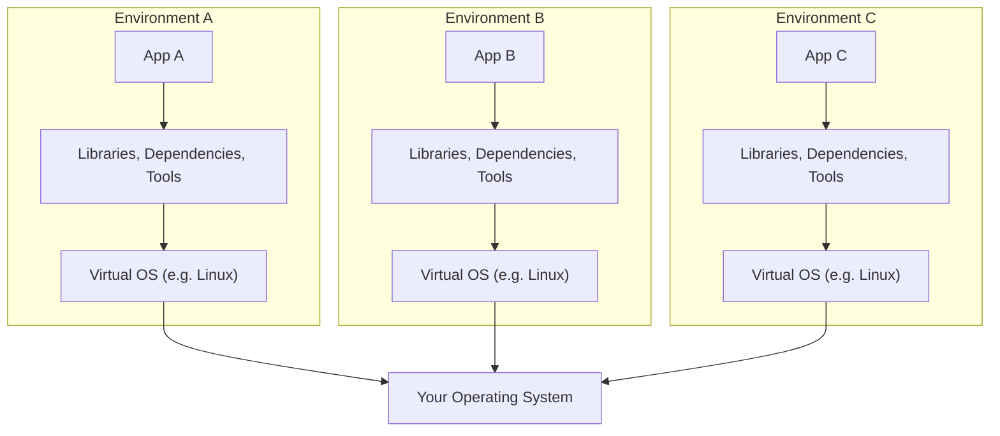
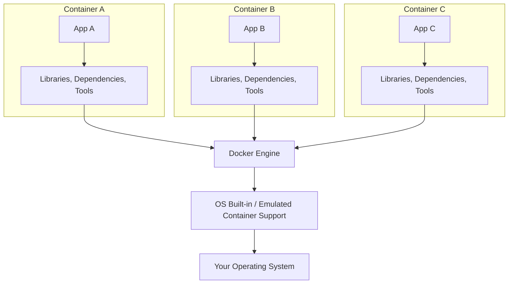

# Docker

### What is Docker?

* Docker is a container technology: A tool for creating and managing containers
* Container is a standardized unit of software.
  - a package of code**and** dependencies to run that code. (ex. Py code + the Py runtime)
  - the same container yields the exact same application and execution behaviour, irrespective of executor or the system of execution.

### Why Containers?

For independent and standardized "application packages"

* because we want the`exact same env` for dev & prod
* we want`reproducibility` of behaviour
* for isolation of dependencies/preventing dependency conflicts

### Virutal Machines vs. Docker Containers

* Simple Virtual Machine structure

- This wastes a lot of space on the hard drive and tends to be slow



| Pros of VM                                     |                      Cons of VM                      |
| ---------------------------------------------- | :--------------------------------------------------: |
| Separated environments                         |              Redundant, Waste of space              |
| Env-specific config                            |        Slow performance and longer boot time        |
| Shareable env-config for reproducing behaviour | reproducing on another server is possible but tricky |

### Docker Containers



| Docker Containers                                  | Virtual Machines                                                     |
| -------------------------------------------------- | -------------------------------------------------------------------- |
| Low impact on OS, very fast and minimal disk usage | High impact on OS, slower and higher disk usage                      |
| Sharing, re-building & distribution is easy        | Sharing, re-building & distribution can be tricky                    |
| Encapsulates the app/environment                   | Encapsulates the whole machine ~ results in bloating the application |


### Images

- Images are **blueprints / templates** for containers — they do not run themselves
- Contain the app code + required tools, runtimes, and OS dependencies
- Images are **read-only**; no application data is stored in them
- Come in two flavors:
  - **Pre-built** — pulled from Docker Hub (e.g. `node`, `python`, `nginx`)
  - **Custom** — defined by writing your own `Dockerfile`

### Containers

- Containers are **running instances of Images**
- When a container is created (`docker run`), a thin **read-write layer** is added on top of the image
- Multiple containers can run from the **same image**, each fully isolated with their own data
- Data in the container layer is **ephemeral** — lost when the container is removed

```
┌────────────────────────────────────────────┐
│  Container Writable Layer  ✏️               │  ← unique per container, lost on removal
├────────────────────────────────────────────┤
│  Layer N: CMD ["npm", "start"]  🔒          │
│  Layer 3: EXPOSE 80             🔒          │  ← read-only image layers
│  Layer 2: RUN npm install       🔒          │  ← cached & shared across containers
│  Layer 1: COPY . /app           🔒          │
│  Layer 0: FROM node (base image) 🔒         │
└────────────────────────────────────────────┘
```

### Image Layers & Caching

- Every Dockerfile instruction creates a **new layer** in the image
- Docker **caches** unchanged layers — only modified layers and those after are rebuilt
- Layers are **shared between images**, keeping images small and builds fast
- The `CMD` instruction is special: it runs when the **container starts**, not during the build

### Building a Custom Image (Dockerfile)

Key Dockerfile instructions:

| Instruction | Purpose |
|---|---|
| `FROM <image>` | Base image to build upon |
| `WORKDIR <path>` | Set working directory inside container |
| `COPY <src> <dest>` | Copy files from host into the container |
| `RUN <cmd>` | Execute a command during image build |
| `EXPOSE <port>` | Document the port the app listens on |
| `CMD ["cmd"]` | Default command to run when container starts |

```Dockerfile
FROM node                   # start from official node base image
WORKDIR /app                # all subsequent commands run from /app
COPY . /app                 # copy host project files into /app
RUN npm install             # install dependencies (runs at build time)
EXPOSE 80                   # document that app listens on port 80
CMD ["node", "server.js"]   # run the app when container starts
```

### Image Commands

```bash
# Build an image from the Dockerfile in the current directory
docker build .

# Build and tag the image with a name
docker build -t <name> .

# Build and tag with a specific version tag
docker build -t <name>:<tag> .

# Build from a Dockerfile in a different directory
docker build -t <name> <path-to-dockerfile-dir>

# List all locally available images
docker images

# Remove a specific image by ID or name
docker rmi <image-id>

# Remove all dangling (untagged) images
docker image prune

# Remove ALL locally stored images
docker image prune -a

# Inspect detailed metadata of an image (layers, config, etc.)
docker image inspect <image-name>

# Pull an image from Docker Hub
docker pull <image-name>

# Pull a specific version
docker pull <image-name>:<tag>

# Push a local image to Docker Hub
docker push <image-name>:<tag>
```

### Container Commands

```bash
# Create and start a container from an image
docker run <image-name>

# Run with port mapping (host-port:container-port)
docker run -p 3000:80 <image-name>

# Run in detached (background) mode
docker run -d <image-name>

# Run in interactive terminal mode (e.g. for node REPL)
docker run -it <image-name>

# Run with a custom container name
docker run --name <container-name> <image-name>

# Automatically remove container when it stops
docker run --rm <image-name>

# Combine flags: detached, port-mapped, named, auto-remove
docker run -d -p 3000:80 --name myapp --rm <image-name>

# List all running containers
docker ps

# List all containers (running + stopped)
docker ps -a

# Stop a running container (graceful shutdown)
docker stop <container-id or name>

# Start a previously stopped container (non-interactive)
docker start <container-id or name>

# Start and attach to a stopped container (see output)
docker start -a <container-id or name>

# Start in interactive + attached mode
docker start -ai <container-id or name>

# Remove a stopped container
docker rm <container-id or name>

# Remove multiple containers at once
docker rm <container-1> <container-2>

# Remove all stopped containers at once
docker container prune

# View logs of a container
docker logs <container-id or name>

# Follow logs in real time
docker logs -f <container-id or name>
```

### Attach & Detach

```bash
# Attach to a running (detached) container to see its output
docker attach <container-id or name>

# Detach from an attached container without stopping it
# (keyboard shortcut while attached)
Ctrl + P, Ctrl + Q

# Attach with stdin support (useful for interactive containers)
docker attach --sig-proxy=false <container-id or name>
```

### Exec — Run Commands in a Running Container

```bash
# Run a one-off command inside a running container
docker exec <container-id or name> <command>

# Open an interactive bash shell inside a running container
docker exec -it <container-id or name> bash

# Run a command as a specific user
docker exec -it -u root <container-id or name> bash

# Set an environment variable for the exec session
docker exec -it -e MY_VAR=value <container-id or name> bash

# Run a command in a specific working directory
docker exec -it -w /app <container-id or name> bash
```

### Inspect

```bash
# Inspect full metadata of a container (network, mounts, config, etc.)
docker container inspect <container-id or name>

# Inspect an image (layers, env vars, entrypoint, etc.)
docker image inspect <image-name>

# Inspect and extract a specific field using format
docker inspect --format='{{.NetworkSettings.IPAddress}}' <container-id>
```

### Copy Files To / From a Container

```bash
# Copy a file FROM a container to the host
docker cp <container-id or name>:<path-in-container> <path-on-host>
# e.g. docker cp myapp:/app/logs/error.log ./error.log

# Copy a file FROM the host INTO a container
docker cp <path-on-host> <container-id or name>:<path-in-container>
# e.g. docker cp ./config.json myapp:/app/config.json

# Copy an entire directory
docker cp <container-id>:/app/dist ./dist
```

### Sharing Images (DockerHub & Tags)

```bash
# Tag an existing image with a new name / DockerHub repo name
docker tag <local-image-name> <dockerhub-username>/<repo-name>:<tag>
# e.g. docker tag myapp vardharajmannar/myapp:latest

# Login to DockerHub
docker login

# Push image to DockerHub
docker push <dockerhub-username>/<repo-name>:<tag>

# Pull image from DockerHub
docker pull <dockerhub-username>/<repo-name>:<tag>

# Logout from DockerHub
docker logout
```

### Deleting Images & Containers

```bash
# Remove a specific stopped container
docker rm <container-id or name>

# Force-remove a running container (use with caution)
docker rm -f <container-id or name>

# Remove all stopped containers
docker container prune

# Remove a specific image
docker rmi <image-id or name>

# Remove multiple images
docker rmi <image-1> <image-2>

# Force-remove an image (even if a container is using it)
docker rmi -f <image-id>

# Remove all dangling (untagged) images
docker image prune

# Remove ALL unused images (not just dangling)
docker image prune -a

# Nuclear option: remove all stopped containers + unused images + build cache
docker system prune
docker system prune -a   # also removes images not used by any container
```